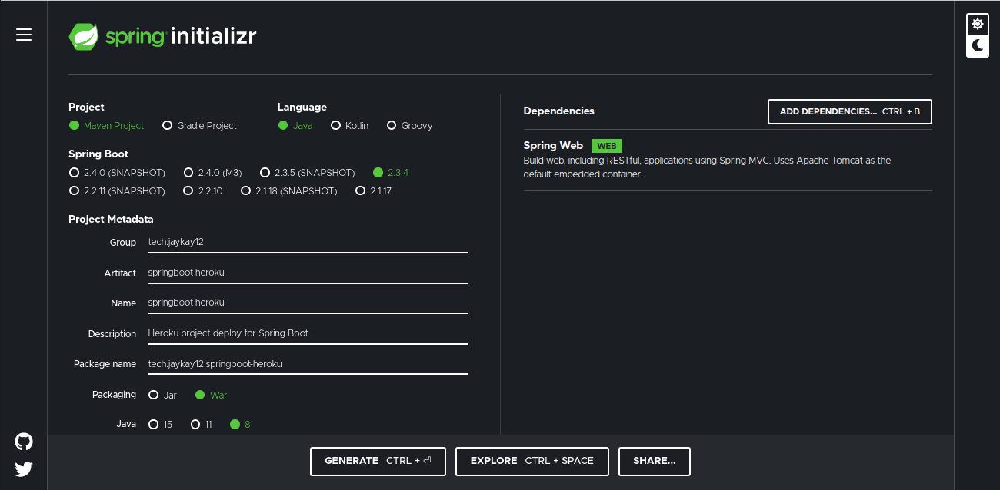

## Terminology
 - **spring boot:**
 - **heroku:** A cloud platform as a service supporting several programming languages.
 - **maven:**

## Creating a Spring Boot API locally

**Step 1:** Initialise Spring Boot API using [Spring Initializr](https://start.spring.io/)



**Step 2:** Extract the zipped directory & open it as a project in IntelliJ. Maven will configure itself accordingly.

**Step 3:** Create the following java files in the src directory:

`RunnerApplication.java`

```java
package tech.jaykay12.sbheroku;

import org.springframework.boot.SpringApplication;
import org.springframework.boot.autoconfigure.SpringBootApplication;

@SpringBootApplication
public class RunnerApplication {

   public static void main( String[] args ) {
       SpringApplication.run(RunnerApplication.class,args);
   }
}
```

`APIController.java`

```java
package tech.jaykay12.sbheroku;

import org.springframework.web.bind.annotation.RequestMapping;
import org.springframework.web.bind.annotation.RestController;

@RestController
public class APIController {

    @RequestMapping("/")
    public String index(){
        return "Spring BOOT Running!\n";
    }
}
```

`Tweaks`
1. Delete the <provided> scope of spring-boot-starter-tomcat from `pom.xml`
2. Set the custom port for spring boot embedded tomcat to run by editing `application.properties`

**Step 4:** Run the Spring Boot API using IntelliJ options or either post the .war packaging to any tomcat container.

```text
.   ____          _            __ _ _
/\\ / ___'_ __ _ _(_)_ __  __ _ \ \ \ \
( ( )\___ | '_ | '_| | '_ \/ _` | \ \ \ \
\\/  ___)| |_)| | | | | || (_| |  ) ) ) )
'  |____| .__|_| |_|_| |_\__, | / / / /
=========|_|==============|___/=/_/_/_/
```
```bash
:: Spring Boot ::        (v2.3.4.RELEASE)

2020-10-15 23:57:02.695  INFO 20682 --- [main] t.jaykay12.sbheroku.RunnerApplication    : Starting RunnerApplication on jalaz-personal with PID 20682 (/home/jalaz/Documents/springboot-heroku/target/classes started by jalaz in /home/jalaz/Documents/springboot-heroku)
2020-10-15 23:57:02.699  INFO 20682 --- [main] t.jaykay12.sbheroku.RunnerApplication    : No active profile set, falling back to default profiles: default
2020-10-15 23:57:04.416  INFO 20682 --- [main] o.s.b.w.embedded.tomcat.TomcatWebServer  : Tomcat initialized with port(s): 8090 (http)
2020-10-15 23:57:04.437  INFO 20682 --- [main] o.apache.catalina.core.StandardService   : Starting service [Tomcat]
2020-10-15 23:57:04.437  INFO 20682 --- [main] org.apache.catalina.core.StandardEngine  : Starting Servlet engine: [Apache Tomcat/9.0.38]
2020-10-15 23:57:04.600  INFO 20682 --- [main] o.a.c.c.C.[Tomcat].[localhost].[/]       : Initializing Spring embedded WebApplicationContext
2020-10-15 23:57:04.600  INFO 20682 --- [main] w.s.c.ServletWebServerApplicationContext : Root WebApplicationContext: initialization completed in 1727 ms
2020-10-15 23:57:04.943  INFO 20682 --- [main] o.s.s.concurrent.ThreadPoolTaskExecutor  : Initializing ExecutorService 'applicationTaskExecutor'
2020-10-15 23:57:05.335  INFO 20682 --- [main] o.s.b.w.embedded.tomcat.TomcatWebServer  : Tomcat started on port(s): 8090 (http) with context path ''
2020-10-15 23:57:05.353  INFO 20682 --- [main] t.jaykay12.sbheroku.RunnerApplication    : Started RunnerApplication in 3.669 seconds (JVM running for 4.506)
```


**Step 5:** On hitting, `localhost:8090`, if you get _Spring BOOT Running!_. Kudos, You got your Spring Boot API running locally.

## Using already created Spring Boot API

**Step 1:**
Get local copy of the API using
```bash
wget https://github.com/jaykay12/tech/assets/demos/springboot-heroku.zip
```

**Step 2 to 5:** Remains the same as above.

## Deploying on Heroku

**Step 1:** Logging into Heroku using heroku cli
```bash

```


**Step 2:** Create a heroku app inside the directory
```bash

```

**Step 3:** Set Buildpacks for the app
```bash

```

**Step 4:**

**Step 5:** Create a `Procfile` with the following content.
```text

```

_Procfile: A text file in the root directory of your application, to explicitly declare what command should be executed to start your app_

**Step 6:** Commit these new deployment changes.
```bash

```

**Step 7:** Push to deploy.
```bash

```
