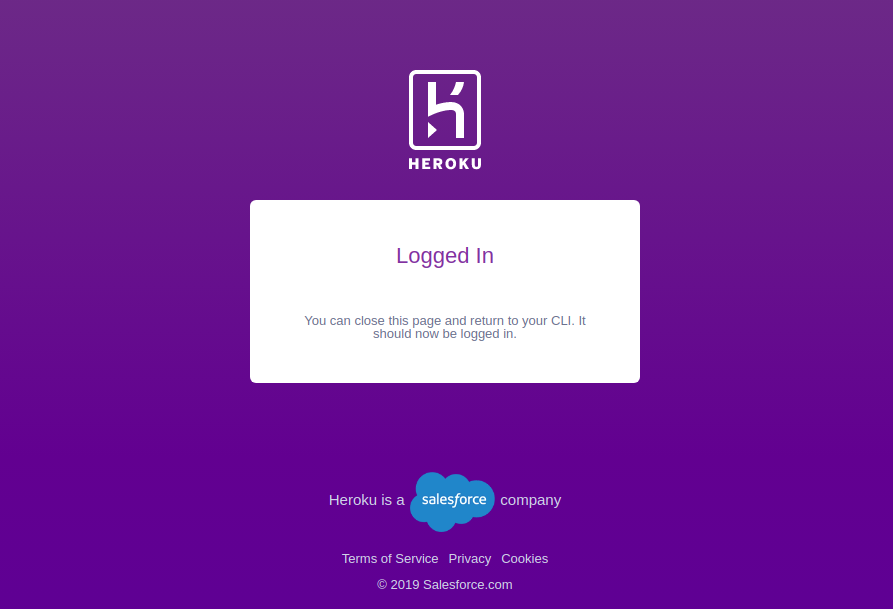

## Terminology
 - **virtualenv:** A tool to create isolated Python environments
 - **flask:** A micro web framework written in Python. It is classified as a microframework because it does not require particular tools or libraries. _It has no database abstraction layer, form validation, or any other components where pre-existing third-party libraries provide common functions._
 - **heroku:** A cloud platform as a service supporting several programming languages.
 - **pip:** A de facto standard package-management system used to install and manage software packages written in Python.

## Creating a flask API locally

**Step 1:** Initialise virtualenv for the flask API
```bash
jalaz@jalaz-personal:~/tech/assets/demos/flask-heroku$ virtualenv venv
Using base prefix '/usr'
New python executable in /tech/assets/demos/flask-heroku/venv/bin/python3
Not overwriting existing python script /tech/assets/demos/flask-heroku/venv/bin/python (you must use /tech/assets/demos/flask-heroku/venv/bin/python3)
Installing setuptools, pip, wheel...
done.
```

**Step 3:** Activate the virtualenv & install flask Using
```bash
jalaz@jalaz-personal:~/tech/assets/demos/flask-heroku$ source venv/bin/activate
(venv) jalaz@jalaz-personal:~/tech/assets/demos/flask-heroku$ pip install flask
Collecting flask
  Using cached Flask-1.1.2-py2.py3-none-any.whl (94 kB)
Collecting Jinja2>=2.10.1
  Using cached Jinja2-2.11.2-py2.py3-none-any.whl (125 kB)
Collecting itsdangerous>=0.24
  Using cached itsdangerous-1.1.0-py2.py3-none-any.whl (16 kB)
Collecting Werkzeug>=0.15
  Using cached Werkzeug-1.0.1-py2.py3-none-any.whl (298 kB)
Collecting click>=5.1
  Downloading click-7.1.2-py2.py3-none-any.whl (82 kB)
     |████████████████████████████████| 82 kB 16 kB/s
Collecting MarkupSafe>=0.23
  Using cached MarkupSafe-1.1.1-cp37-cp37m-manylinux1_x86_64.whl (27 kB)
Installing collected packages: MarkupSafe, Jinja2, itsdangerous, Werkzeug, click, flask
Successfully installed Jinja2-2.11.2 MarkupSafe-1.1.1 Werkzeug-1.0.1 click-7.1.2 flask-1.1.2 itsdangerous-1.1.0
```

**Step 3:** Create a `main.py` file with the following content

```python
from flask import Flask
app = Flask(__name__)


@app.route('/')
def intro():
    return "Flask App Running...!"

if __name__ == '__main__':
    app.run()
```

**Step 4:** Run the flask app using `python app.py`
```bash
(venv) jalaz@jalaz-personal:~/tech/assets/demos/flask-heroku$ python app.py
 * Serving Flask app "app" (lazy loading)
 * Environment: production
   WARNING: This is a development server. Do not use it in a production deployment.
   Use a production WSGI server instead.
 * Debug mode: off
 * Running on http://127.0.0.1:5000/ (Press CTRL+C to quit)
```

**Step 5:** On hitting, `localhost:5000`, if you get _Flask App Running...!_. Kudos, You got your flask API running locally.

## Using already created flask API
**Step 1:**
Get local copy of the project using
```bash
wget https://github.com/jaykay12/tech/assets/demos/flask-heroku.zip
```

**Step 2:** Create a virtualenv for the python web app using
```bash
virtualenv venv
```

**Step 3:** Activate the virtualenv using
```bash
source venv/bin/activate
```

**Step 4:** Install all the packages using
```bash
pip install -r requirements.txt
```

**Step 5:** Run the flask app using `python app.py`
```bash
(venv) jalaz@jalaz-personal:~/tech/assets/demos/flask-heroku$ python app.py
 * Serving Flask app "app" (lazy loading)
 * Environment: production
   WARNING: This is a development server. Do not use it in a production deployment.
   Use a production WSGI server instead.
 * Debug mode: off
 * Running on http://127.0.0.1:5000/ (Press CTRL+C to quit)
```

**Step 5:** On hitting, `localhost:5000`, if you get _Flask App Running...!_. Kudos, You got your flask API running locally.

## Deploying on Heroku

**Step 1:** Logging into Heroku using heroku cli
```bash
jalaz@jalaz-personal:~/tech/assets/demos/flask-heroku$ heroku login
heroku: Press any key to open up the browser to login or q to exit:
Opening browser to https://cli-auth.heroku.com/auth/cli/browser/xxxx-xxx-xxx
Logging in... done
Logged in as jalazkumar1208@gmail.com
```



**Step 2:** Create a heroku app inside the directory
```bash
jalaz@jalaz-personal:~/tech/assets/demos/flask-heroku$ heroku create flask-heroku-jalaz
Creating ⬢ flask-heroku-jalaz... done
https://flask-heroku-jalaz.herokuapp.com/ | https://git.heroku.com/flask-heroku-jalaz.git
```

**Step 3:** Set Buildpacks for the app
```bash
jalaz@jalaz-personal:~/tech/assets/demos/flask-heroku$ heroku buildpacks:set heroku/python --app flask-heroku-jalaz
Buildpack set. Next release on flask-heroku-jalaz will use heroku/python.
Run git push heroku master to create a new release using this buildpack.
```

**Step 4:** Create `requirements.txt` file for the project if it doesn't exist using `pip freeze > requirements.txt`

**Step 5:** Create a `Procfile` with the following content.
```text
web: gunicorn app:app
```

_Procfile: A text file in the root directory of your application, to explicitly declare what command should be executed to start your app_

**Step 6:** Commit these new deployment changes.
```bash
jalaz@jalaz-personal:~/tech/assets/demos/flask-heroku$ git status
On branch master
Untracked files:
  (use "git add <file>..." to include in what will be committed)

	Procfile
nothing added to commit but untracked files present (use "git add" to track)
jalaz@jalaz-personal:~/tech/assets/demos/flask-heroku$ git add Procfile
jalaz@jalaz-personal:~/tech/assets/demos/flask-heroku$ git commit -m "Added Procfile"
[master 1210ae4] Added Procfile
 1 file changed, 1 insertion(+)
 create mode 100644 Procfile
```

**Step 7:** Push to deploy.
```bash
jalaz@jalaz-personal:~/tech/assets/demos/flask-heroku$ git push heroku master
Enumerating objects: 10, done.
Counting objects: 100% (10/10), done.
Delta compression using up to 4 threads
Compressing objects: 100% (8/8), done.
Writing objects: 100% (10/10), 1001 bytes | 500.00 KiB/s, done.
Total 10 (delta 1), reused 0 (delta 0)
remote: Compressing source files... done.
remote: Building source:
remote:
remote: -----> Python app detected
remote: -----> Installing python-3.6.11
remote: -----> Installing pip
remote: -----> Installing SQLite3
remote: -----> Installing requirements with pip
remote:        Collecting click==7.1.2
remote:          Downloading click-7.1.2-py2.py3-none-any.whl (82 kB)
remote:        Collecting Flask==1.1.2
remote:          Downloading Flask-1.1.2-py2.py3-none-any.whl (94 kB)
remote:        Collecting itsdangerous==1.1.0
remote:          Downloading itsdangerous-1.1.0-py2.py3-none-any.whl (16 kB)
remote:        Collecting Jinja2==2.11.2
remote:          Downloading Jinja2-2.11.2-py2.py3-none-any.whl (125 kB)
remote:        Collecting MarkupSafe==1.1.1
remote:          Downloading MarkupSafe-1.1.1-cp36-cp36m-manylinux1_x86_64.whl (27 kB)
remote:        Collecting Werkzeug==1.0.1
remote:          Downloading Werkzeug-1.0.1-py2.py3-none-any.whl (298 kB)
remote:        Installing collected packages: click, Werkzeug, itsdangerous, MarkupSafe, Jinja2, Flask
remote:        Successfully installed Flask-1.1.2 Jinja2-2.11.2 MarkupSafe-1.1.1 Werkzeug-1.0.1 click-7.1.2 itsdangerous-1.1.0
remote: -----> Discovering process types
remote:        Procfile declares types -> web
remote:
remote: -----> Compressing...
remote:        Done: 45.1M
remote: -----> Launching...
remote:        Released v3
remote:        https://flask-heroku-jalaz.herokuapp.com/ deployed to Heroku
remote:
remote: Verifying deploy... done.
To https://git.heroku.com/flask-heroku-jalaz.git
 * [new branch]      master -> master
```
