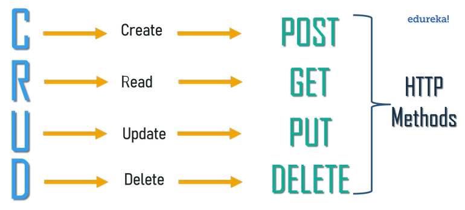

It stands for “REpresentational State Transfer”. It is a set of rules or architectural style that developers should follow while creating APIs or Web Services. Presented by Roy Fielding in 2000 as doctoral dissertation.
Web services that conform to the REST architectural style, are called RESTful Web services, provide interoperability between computer systems on the internet.

An **API** is an application programming interface. It is a set of rules that allow programs to talk to each other. The developer creates the API on the server and allows the client to talk to it. **REST** determines how the API looks like.

Each URL is called a request while the data sent back to you is called a response.
Each request comprises of 4 components:

- <ins>Endpoint:</ins> Also called route, is the url you request for. Comprises of (root-endpoint + path)

- <ins>Methods:</ins> GET/POST/PUT/DELETE/PATCH

- <ins>Headers:</ins> Used to provide information to both the client and server. It can be used for many purposes, such as authentication and providing information about the body content.

- <ins>Body:</ins> Contains information which is to be sent to the server. This option is only used with POST, PUT, PATCH or DELETE requests. Also called "data" or "message".

_REST got its name as it's based upon creating an object of the data requested by the client on server-side and send the values of the object (state of object) as the response to the user_

## Guiding Principles of REST

- Client–server
- Stateless
- Cacheable
- Uniform interface
- Layered system
- Code on demand (optional)

**Client–server :**

**Stateless :**

**Cacheable :**

**Uniform interface :**

**Layered system :**

**Code on demand :**

Till the time, we are honoring the 6 guiding principles of REST, we can call our interface RESTful.

> All these principles help RESTful applications to be simple, lightweight, and fast.

- **GET** request to _/user/_ returns a list of registered users on a system.

- **POST** request to _/user/123_ creates a user with the ID 123 using the body data.

- **PUT** request to _/user/123_ updates user 123 with the body data.

- **GET** request to _/user/123_ returns the details of user 123.

- **DELETE** request to _/user/123_ deletes user 123.

## Extra information

`REST vs HTTP`:

In the **REST** architectural style, data and functionality are considered resources and are accessed using Uniform Resource Identifiers (URIs). The resources are acted upon by using a set of simple, well-defined operations. The clients and servers exchange representations of resources by using a standardized interface and protocol – typically **HTTP**.

> REST != HTTP

`SOAP APIs`:
