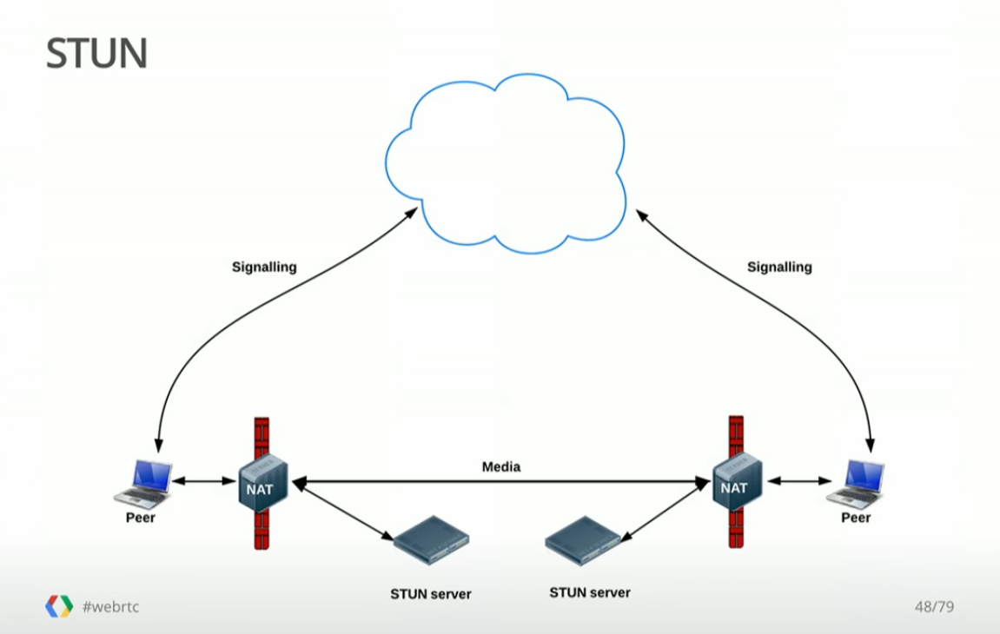
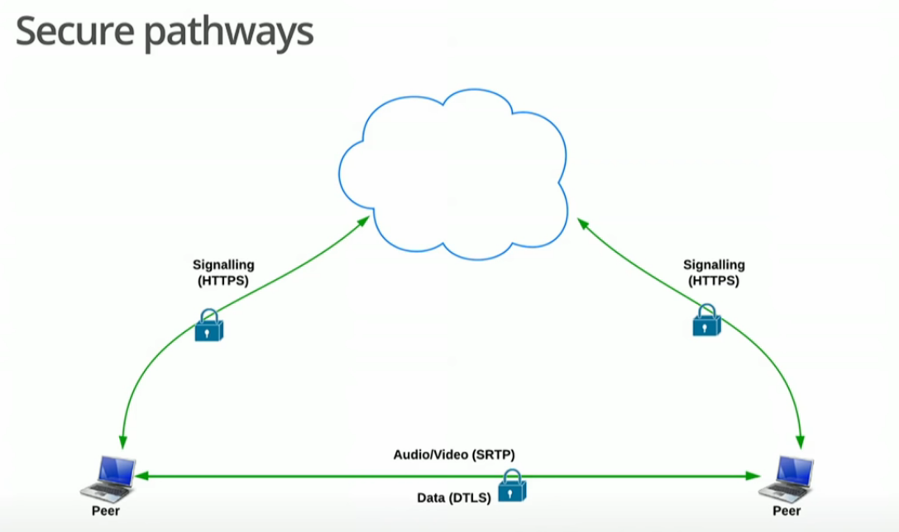
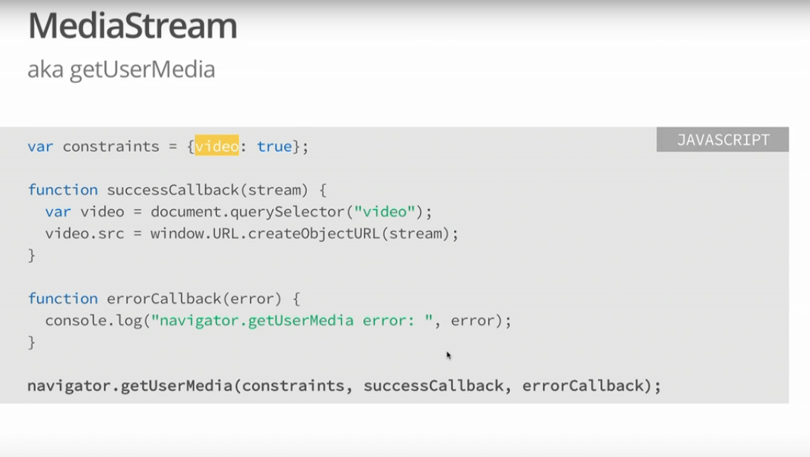
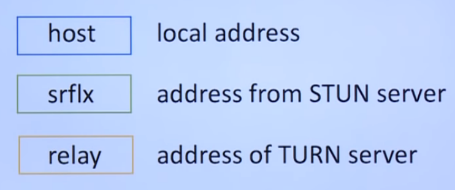
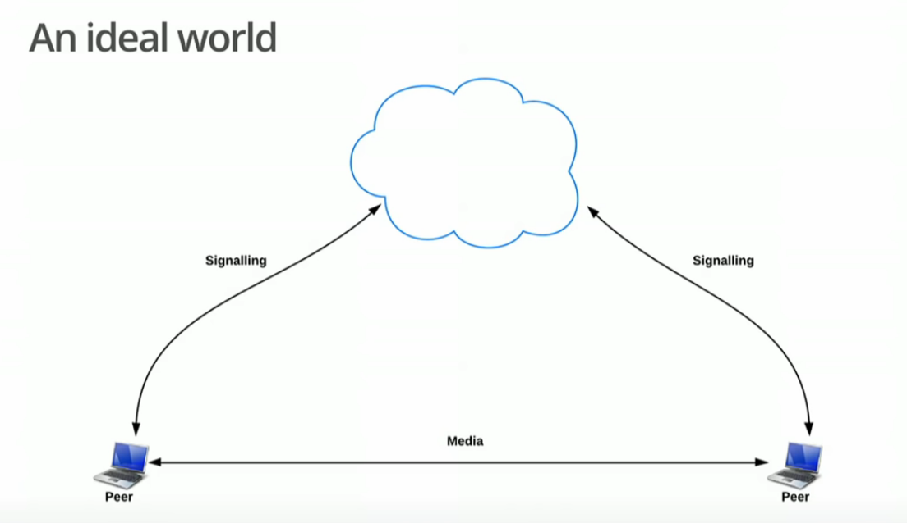
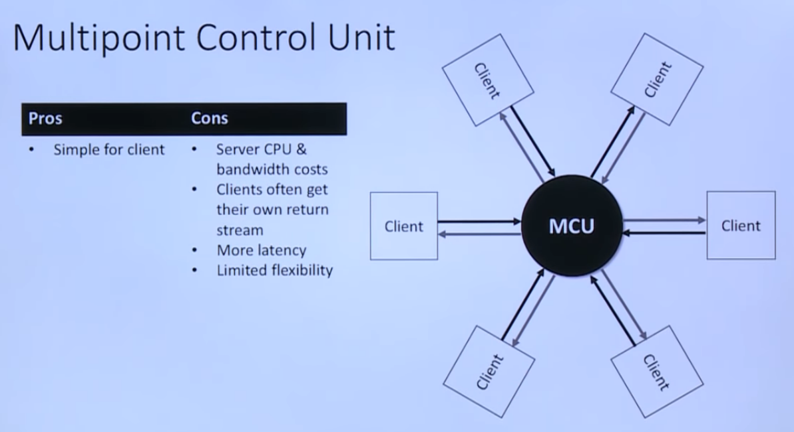
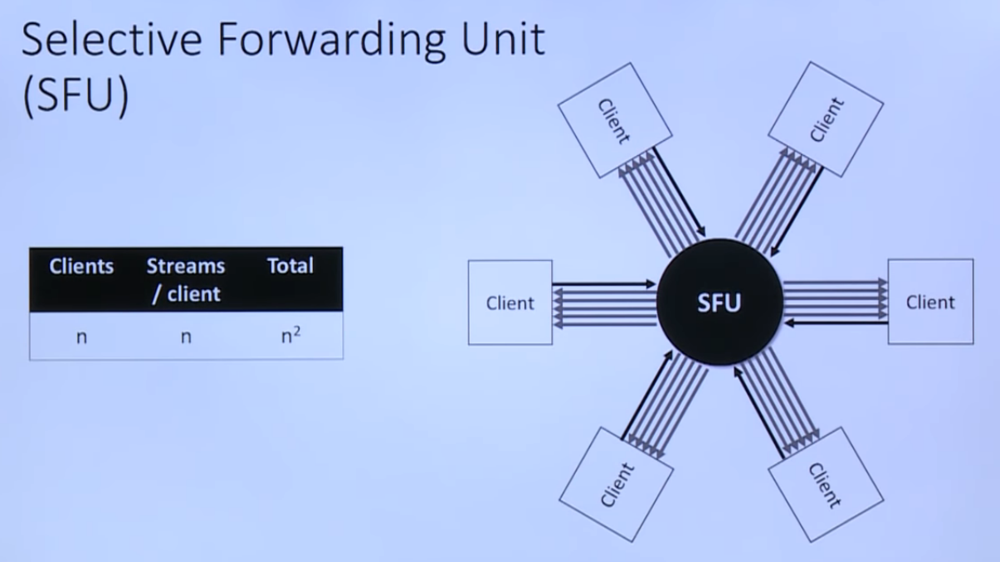
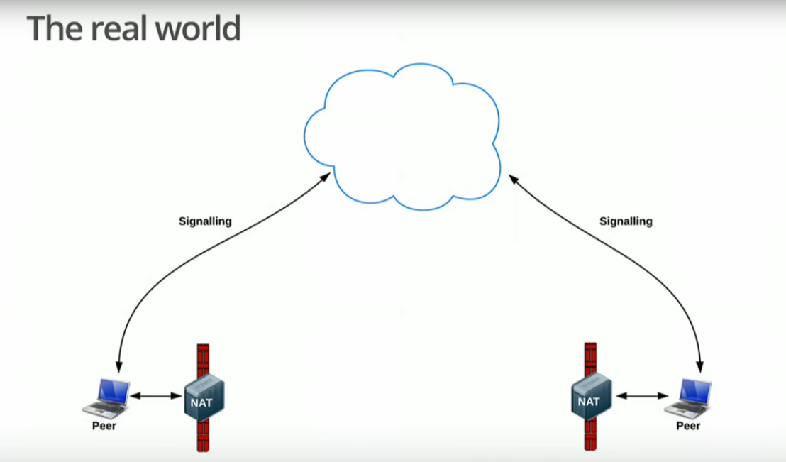

<ins>**WebRTC**</ins>
  - Low cost, high quality audio & video communication

<ins>**Need for WebRTC**</ins>

General flow of information without WebRTC is like this. This will lead to network latency which is really bad for services like real time gaming, video conferencing, streaming etc.

<ins>**Challenges for WebRTC**</ins>
  - WebRTC works via UDP
  - There is no standard signalling protocol
  - Not fully compatible with all browsers

## WebRTC API & connections setup

<ins>**WebRTC Architecture**</ins>

<ins>**Main Tasks & APIs supporting**</ins>
  - Acquiring audio and video - `MediaStream API`
  - Communicating audio and video - `RTCPeerConnection API`
  - Communicating arbitrary data - `RTCDataChannel API`

<ins>**MediaStream API**</ins>

<ins>**RTCPeerConnection API**</ins>

<ins>**RTCDataChannel API**</ins>

<ins>**WebRTC Connection Setup flow**</ins>

## Servers for WebRTC

Majorly, 4 types of servers are required in WebRTC:

<ins>**Signalling Servers**</ins>

  - WebRTC uses RTCPeerConnection for communicating streaming data between peers

  - Signalling is a mechanism to coordinate this communication and sending control messages.

  - In Signalling, Peers exchanges 3 types of information:
    - Session control messages: Initialising & closing connections
    - Network configuration: IP Addresses & ports
    - Media capabilities: Media codecs & resolution handled by browser

`Signal Description Protocol` objects are exchanged which carry:
  - Format supported
  - Information that is to be sent( Audio/Video/Data)
  - Networking information for Peer-to-Peer connection setup

There is no standarisation for Signalling from WebRTC end. Usage of any messaging mechanism & protocol is on implementers' choice.

<ins>**STUNs & TURNs**</ins>

`Issue of NAT Traversal`

In the ideal world, all devices are having unique IP and are easily identifiable.
There is no issue in connecting peers.

But in the real world, due to lack of IP address spaces, various gateways, NATs are used which provide private IPs to the internal devices and this private IP is masked to the outside world.
So, setting up a connection between peers seems tough during WebRTC negotiation.

To tackle this situation, `ICE` was introduced.

`ICE: Interactive Connectivity Establishment`
Protocol for establishing peer-to-peer media connections between peers behind NATs and firewall devices.

Using ICE, tries to find the best path for each call.
Around 86% of the calls are P2P & 14% are Relayed.

2 Types of ICE Servers:
  - STUN Servers
  - TURN Servers

`STUN (Session Traversal Utilities for NAT)`
  - Tell me what my public IP address is
  - Simple server, cheap to run
  - Data flows peer-to-peer

  

  

`TURN (Traversal using Relay NAT)`
  - Provides a cloud fallback, if P2P communication fails
  - Data is relayed through this server, uses server bandwidth
  - Ensures the call works in almost all environments

  

  

||STUN|TURN|
|---|---|---|
||Session Traversal Utilities for NAT|Traversal using Relay NAT|
|Work|Returns the external IP address|Relays media|
|When needed|Almost always|Infrequently|
|Operation cost|Cheap|Expensive|

## Improvements in WebRTC

