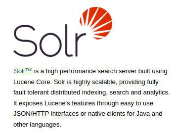
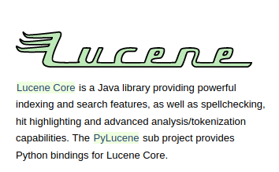
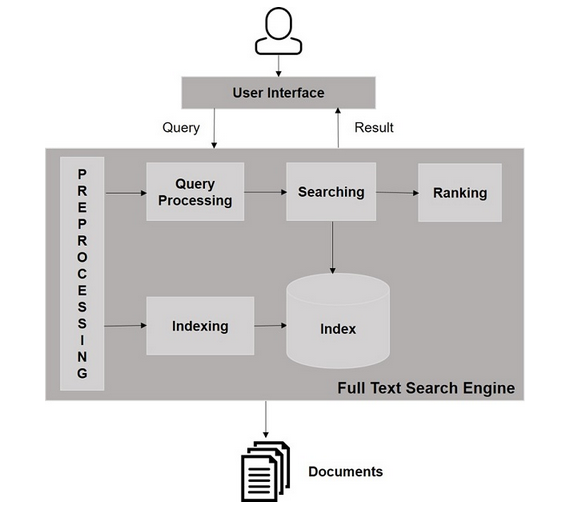

`Apache Solr` is a Scalable & Portable search/storage engine used for searching large volumes of text-centric data.

  - Open Source (search/storage) platform

  - Enterprise Search server

  - Used for building Search Applications and Search APIs

  - Created by Yonik Seely in 2004

  - Apache Solr is built on top of Apache Lucene.

  - Along with Search purpose, Solr can be used for storage purpose as well just like No-SQL Databases.

  - Provides capabilities for full text search such as tokens, phrases, spell-check etc.

  - Solr exposes Lucene Java APIs as a Rest-full API services.



`Apache Lucene` is Java-based search library. Used to index and search voluminous amount of text. Basically, we store the index using Lucene & exposes searching on this index through SolR Rest APIs.

  - Written by Dough Cutting in 1999

  - Powerful, Scalable & Efficient Search Algorithm



<ins>**Typical Search Flow**</ins>



<ins>**Apache SolR Architecture**</ins>


Building blocks of Apache Solr:
  - <ins>Request Handler</ins>
  Used to process requests on Solr end, can be query request or index update requests

  - <ins>Search Component</ins>
  Feature provided by Solr, example: spellchecking, query, faceting etc.

  - <ins>Query Parser</ins>
  Parses the query passed to Solr, checks for syntactic error & translates them into a format lucene understands

  - <ins>Response Writer</ins>
  Generates formatted output for the queries. Supports xml, json, csv etc.

  - <ins>Analyzer/Tokenizer</ins>
  Lucene recognises data in form of tokens which are passed from Solr end. Analyzer examines the text of fields and generates token stream which is then broken into tokens by the Tokenizer

<ins>**Apache Solr VS ElasticSearch**</ins>


|Apache Solr|ElasticSearch|
|---|---|
|||
|||
|||
|||

## Terminology


## Base Concepts

Solr core is a running instance of a lucene index. We create solr core for performing operations like indexing and analyzing.

## Setting up Solr

```bash
jalaz@jalaz-personal:~/Downloads/solr-6.5.0$ ./bin/solr start
Waiting up to 180 seconds to see Solr running on port 8983
Started Solr server on port 8983 (pid=28500). Happy searching!
```

## Directory structure in Solr
_<Coming soon . . .>_

## Important files in Solr

`Solr.xml`
Contains Solr information. For loading cores, this file is referred.

`solrconfig.xml`
Contains core-specific configurations related to request handlers, indexing, managing memory, managing cache etc.

`schema.xml`
Contains the entire schema including field & field types

`core.properties`
Contains core configuration properties. Is used for core discovery during SolR start.


## Indexing in Solr

Systematically arranging documents in the Solr core.
  - Indexing collects, parses, and stores documents.
  - Indexing is done to increase the speed and performance of a search query while finding a required document.

In Apache Solr, we can index (add, delete, modify) various document formats such as xml, csv, pdf, etc.

Primarily 3 Ways:

  1. <ins>**Solr Web Interface**</ins>

  

  2. <ins>**post tool**</ins>

  ```bash
  jalaz@jalaz-personal:~$ ./bin/post -c mcats similar-mcats.json
  jalaz@jalaz-personal:~$ ./bin/post -c intent -host fts-master.intermesh.net -p 8020 brands.csv
  jalaz@jalaz-personal:~$ ./bin/post -c keyword-mapping -host fts-master2.intermesh.net -p 8020 buyleads/bltransacted-*.xml -commit yes
  ```

  3. <ins>**Client APIs : SolrJ**</ins>

  ```java
      import java.io.IOException;  

      import org.apache.Solr.client.Solrj.SolrClient;
      import org.apache.Solr.client.Solrj.SolrServerException;
      import org.apache.Solr.client.Solrj.impl.HttpSolrClient;
      import org.apache.Solr.common.SolrInputDocument;

      public class DocumentIndexer {
         public static void main(String args[]) throws Exception {

            String urlString = "http://localhost:8983/Solr/mcat";
            SolrClient Solr = new HttpSolrClient.Builder(urlString).build();   

            SolrInputDocument doc = new SolrInputDocument();
            doc.addField("mcatid", "003");
            doc.addField("mcatname", "Paper cutting machine");
            Solr.add(doc);
            Solr.commit();

            System.out.println("Documents indexed");
         }
      }
  ```

<ins>**Deletion/Modification/Addition formats**</ins>


## Querying in Solr
_<Coming soon . . .>_

## Request Handlers & Search Components in Solr
_<Coming soon . . .>_

## Faceting in Solr
_<Coming soon . . .>_

## Clustering in Solr
_<Coming soon . . .>_

## SolrJ
