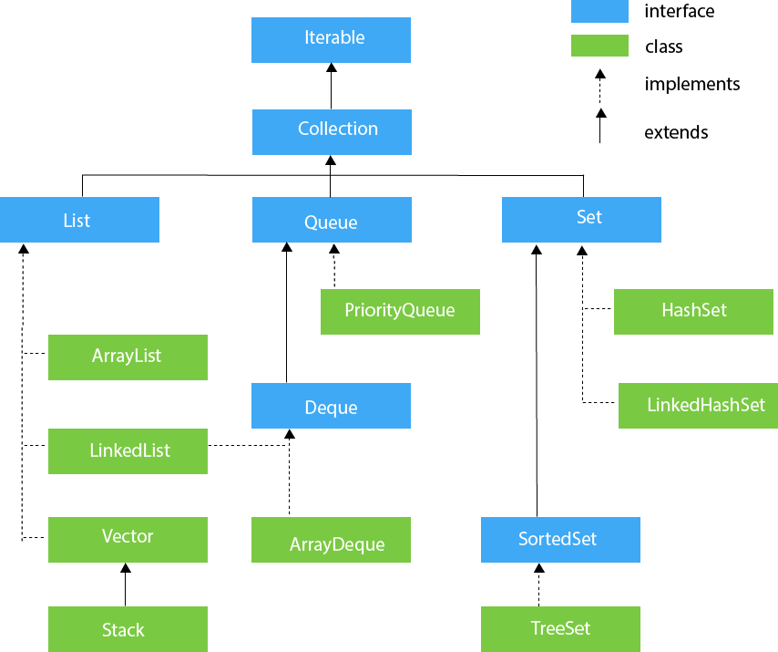

Java collections is a framework that provides an architecture to store and manipulate groups of objects.

Provides many interfaces(Set, List, Queue, Map etc.) and classes (ArrayList, Vector, HashSet, HashMap, TreeSet etc.)

`java.util` package contains all classes and interfaces.



<ins>**Collection interface**</ins>

Declares the methods that every collection will have. Few notable ones are:

- _public boolean add(Object element)_

- _public boolean addAll(Collection<?> c)_

- _public boolean remove(Object element)_

- _public boolean removeAll(Collection<?> c)_

- _public int size()_

- _public void clear()_

- _public boolean contains(Object element)_

- _public boolean containsAll(Collection<?> c)_

- _public Iterator iterator()_

- _public Object[] toArray()_

- _public boolean isEmpty()_

- _public boolean equals(Object element)_

- _public int hashCode()_

<ins>**Iterator interface**</ins>

Provides the facility of iterating the elements in a forward direction.
2 important methods:

- _public boolean hasNext()_

- _public Object next()_


### Lists, ArrayLists & LinkedLists

<ins>**List interface**</ins>
  - Child interface of Collection interface
  - For storing the ordered collection of objects.
  - It can have duplicate values.
  - Implemented by the classes ArrayList, LinkedList, Vector, and Stack.

```java
List<String> fruits = new ArrayList<String>();
fruits.add("Mango");  
fruits.add("Apple");  
fruits.add("Banana");
for(String fruitname: fruits)                       // For-Each Loop
    System.out.println(fruitname);

for(int i=0;i<fruits.size();i++)
    System.out.println(fruits[i]);                  // For Loop

fruits.get(0);                                        // get() is used for accessing
fruits.set(1,"Orange");                               // set() is used for modifying

Collections.sort(fruits);                           // sorting the list

Iterator itr = fruits.iterator();                   // Iterator
while(itr.hasNext()){                               // Forward iterator
    System.out.println(itr.next());    
}

while(itr.hasPrevious()){                           // Backward iterator
    System.out.println(itr.previous());    
}
```

<ins>**Interconversion between Java Array & List**</ins>

```java
String[] languageArray1 = {"Java","Python","PHP","C++"};  
List<String> languageList = new ArrayList<String>();  
for(String languageName: languageArray1){  
    languageList.add(languageName);
}

String[] languageArray2 = languageList.toArray(new String[languageList.size()]);
```

<ins>**ArrayList vs LinkedList**</ins>

|ArrayList|LinkedList|
|---|---|
|Implements List interface and maintains insertion order.|implements List interface and maintains insertion order.|
|Non synchronized|Non synchronized|
|Internally uses a dynamic array to store the elements|Internally uses a doubly linked list to store the elements|
|Manipulation with ArrayList is slow because it internally uses an array. If any element is removed from the array, all the bits are shifted in memory.|Manipulation with LinkedList is faster than ArrayList because it uses a doubly linked list, so no bit shifting is required in memory.|
|Can act as a list only because it implements List only|Can act as a list and queue both because it implements List and Deque interfaces|
|Better for storing and accessing data|Better for manipulating data|

<ins>**Using Objects with List**</ins>

```java
import java.util.*;

class Book {  
    int id;  
    String name;

    public Book(int id, String name) {  
        this.id = id;  
        this.name = name;
    }  
}

public class ObjectWithList {  
    public static void main(String[] args) {  
        List<Book> books = new ArrayList<Book>();
        Book b1 = new Book(101,"Let us C");
        list.add(b1);  
        list.add(new Book(102, "Cormen"));

        for(Book book : books){  
            System.out.println(b.id+" "+b.name);  
        }  
    }  
}
```

### Sets, HashSets & TreeSets

<ins>**Set interface**</ins>
  - Child interface of Collection interface
  - Represents the unordered set of elements which doesn't allow us to store the duplicate items.
  - We can store at most one null value in Set.
  - Set is implemented by HashSet, LinkedHashSet, and TreeSet.

```java
HashSet<String> numbers = new HashSet();  
numbers.add("One");    
numbers.add("Two");    
numbers.add("Three");   
numbers.add("One");

Iterator<String> i = numbers.iterator();  
while(i.hasNext()) {  
    System.out.println(i.next());  
}

numbers.remove("Two");  

ArrayList<String> namesList = new ArrayList<String>();  
namesList.add("Jalaz");  
namesList.add("Atul");

HashSet<String> namesSet = new HashSet(namesList);  
namesSet.add("Gaurav");
```

|HashSet|LinkedHashSet|TreeSet|
|---|---|---|
|Used to create a collection that uses a hash table for storage|Hashtable and Linked list implementation of the set interface|Uses a tree for storage|
|Inherits the `AbstractSet` class and implements `Set` interface|Inherits `HashSet` class and implements `Set` interface|Inherits `AbstractSet` class and implements the `NavigableSet` interface|
|Stores the elements using hashing||objects of the TreeSet class are stored in ascending order.|
|||Access and Retrieval times are quiet fast|
|Contains only unique elements|contains only unique elements|contains only unique elements|
|Allows null value|Permits null elements|Doesn't allow null element|
|Non synchronized|Non synchronized|Non synchronized|
|Doesn't maintain the insertion order. Here, elements are inserted on the basis of their hashcode|Maintains the insertion order|Maintains ascending order|
|Best approach for search operations|||


### Maps, HashMaps & LinkedHashMaps


### Stacks, Queues & PriorityQueues

### HashTable

### EnumSet & EnumMap

### Sorting collections
