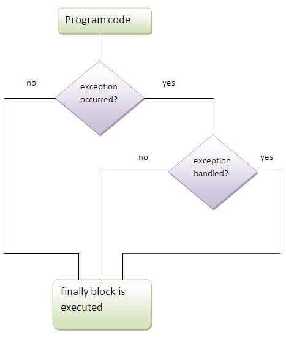

In Java, an exception is an event that disrupts the normal flow of the program.

`Exception Handling` is a mechanism to handle runtime errors such as ClassNotFoundException, IOException, SQLException etc.

### Introduction

  The `java.lang.Throwable` class is the root class of Java Exception hierarchy which is inherited by two subclasses: Exception and Error.

  

  There are 3 types of Exceptions in general way:
  1. Checked Exception
  2. Unchecked Excepetion
  3. Errors

  Errors and Unchecked exceptions are treated as same by Oracle definitons.


  <ins>**Checked Exception**:</ins>
  - All classes which directly inherit the Throwable class except RuntimeException and Error.

  - Examples: `IOException`, `ClassNotFoundException` etc.

  - Can be checked at compile-time.

  - Compiler checks whether these are handled or not. If these exceptions are not handled/declared in the program, compilation error is thrown.


  <ins>**Unchecked Exception**:</ins>
  - All classes which directly inherit the RuntimeException class.

  - Examples: `NullPointerException`, `ArithmeticException` etc.

  - These can only be checked at run-time.


  <ins>**Error**:</ins>
  - These are irrecoverable.

  - They indicate that something severe enough has gone wrong, the application should crash rather than try to handle the error.

  - Examples: `OutOfMemoryError`, `StackOverflowError` etc.

## Important Keywords

  - `try`
     - Used to specify a block where we should place exception code.
     - Must be followed by either catch or finally. We can't use try block alone.


  - `catch`
     - Used to handle the exception.
     - Must be preceded by try block which means we can't use catch block alone.
     - Can be followed by finally block later.


  - `finally`
     - Used to execute the important code of the program.
     - Always executed whether an exception is handled or not.
     - Examples: closing connection, stream etc.
     - Can be used to put "cleanup" code such as closing a file, closing connection etc.


  - `throw`: Used to throw an exception.

  - `throws`
     - Used to declare exceptions.
     - Doesn't throw an exception, rather specifies that there may occur an exception in the method.
     - Always used with method signature.


  ```java
  public class JavaException {  
      public static void main(String args[]) {  
         try {   
                int a1 = 50/0;                      //ArithmeticException
                String s1 = null;  
                int len = s1.length();              //NullPointerException
                String s2 = "abc";
                int i = Integer.parseInt(s);        //NumberFormatException
                int a2[] = new int[5];
                a2[10] = 50;                        //ArrayIndexOutOfBoundsException

         } catch(ArithmeticException e) {System.out.println(e);
         } catch(NullPointerException e) {System.out.println(e);
         } catch(NumberFormatException e) {System.out.println(e);
         } catch(ArrayIndexOutOfBoundsException e) {System.out.println(e);
         }
         finally {
              System.out.println("finally block is always executed");
         }  
         System.out.println("Rest code ...");  
      }  
  }  
  ```

  

  `try` block can be followed by one or more `catch` blocks. Each catch block must contain a different exception handler.

   - At a time only one exception occurs and at a time only one catch block is executed.

   - All catch blocks must be ordered from most specific to most general, i.e. catch for ArithmeticException must come before catch for Exception. (If not done, then compile-time error is generated)


  `finally` Block

  

  `finally` block will not be executed if program exits (either by calling System.exit() or by causing a fatal error that causes the process to abort).

> For each try block there can be zero or more catch blocks, but only one finally block.

## Exception Propagation

An exception is first thrown from the top of the stack and if it is not caught, it drops down the call stack to the previous method, if not caught there, the exception again drops down to the previous method, and so on until they are caught or until they reach the very bottom of the call stack.


- By default, `Unchecked Exceptions` are forwarded in calling chain (propagated).
- By default, `Checked Exceptions` are not forwarded in calling chain (propagated).


### throw & throws

  |throw|throws|
  |---|---|
  |Used for explicitly throwing an exception|Used for declaring an exception|
  |Used within the method|Used with the method signature|
  |Used mainly with unchecked exceptions|Used mainly with checked exceptions|
  |Can't throw multiple exceptions|Can declare multiple exceptions like `public void method()throws IOException, SQLException`|
  |||

### final, finally & finalise

  |final|finally|finalize|
  |---|---|---|
  |Applying restrictions on class, method and variable|Placing important code, for execution whether exception is handled or not|Performing clean up processing just before object is garbage collected|
  |is keyword|is Block|is Method|
  ||||

### Custom Exceptions

  Creating your own Exception that is known as custom exception or user-defined exception. By the help of custom exception, we can have own exception and message.

  `InvalidAgeException.java`
  ```java
  class InvalidAgeException extends Exception {  
      InvalidAgeException(String s){  
          super(s);
      }  
  }  
  ```

  `Runner.java`
  ```java
  class Runner {  
       static void validate(int age) throws InvalidAgeException {  
           if(age<18)  
              throw new InvalidAgeException("Not valid");  
           else  
              System.out.println("Welcome to vote");  
       }  

       public static void main(String args[]) {  
          try {  
              validate(13);  
          } catch(Exception m) { System.out.println("Exception occured: "+m); }  

          System.out.println("Rest of the code ...");  
       }  
  }
```
